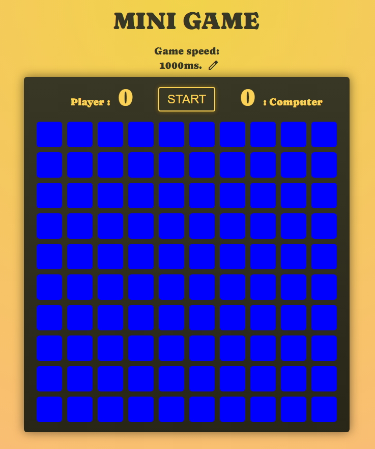
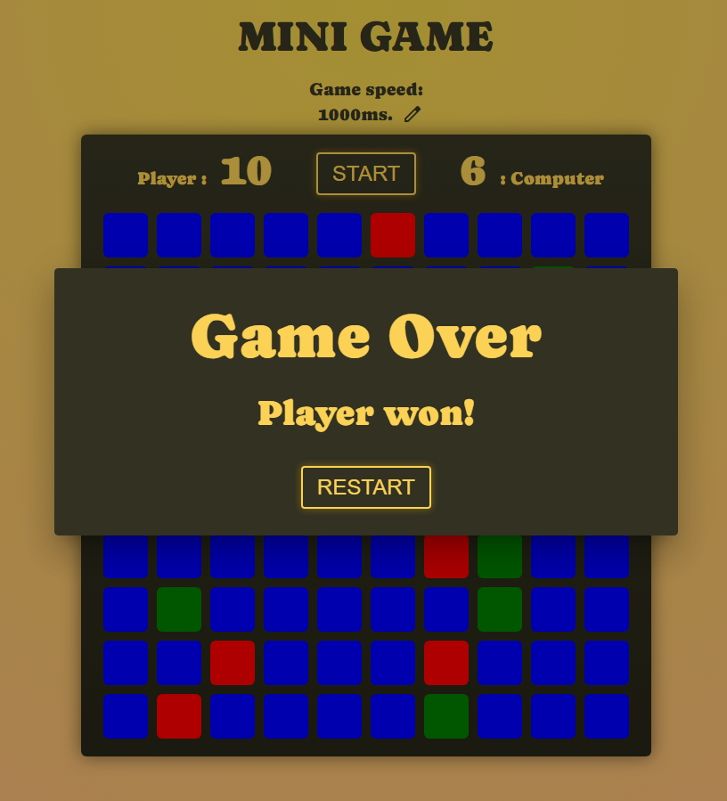
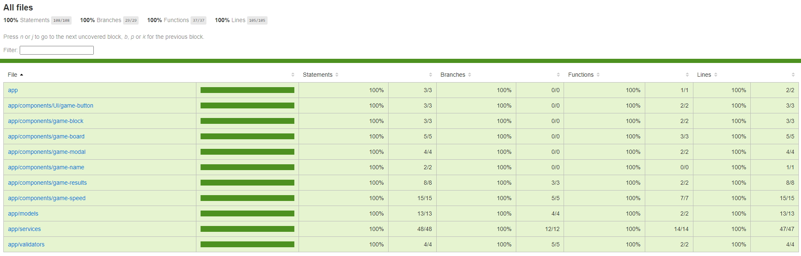

# Application: MINI GAME
Framework: **Angular 16**  
Used technology: **Angular Material** (MatDialogRef), **HTML, SCSS** (Flex, Grid, Variables), **Unit testing** (Karma/Jasmine)  
Used Angular features: **Property binding, Event binding, Dependency Injection, Content Projection, OnPush strategy, RxJS, , Reactive form with castom validator, async pipe and other.**  
Screenshots:  

